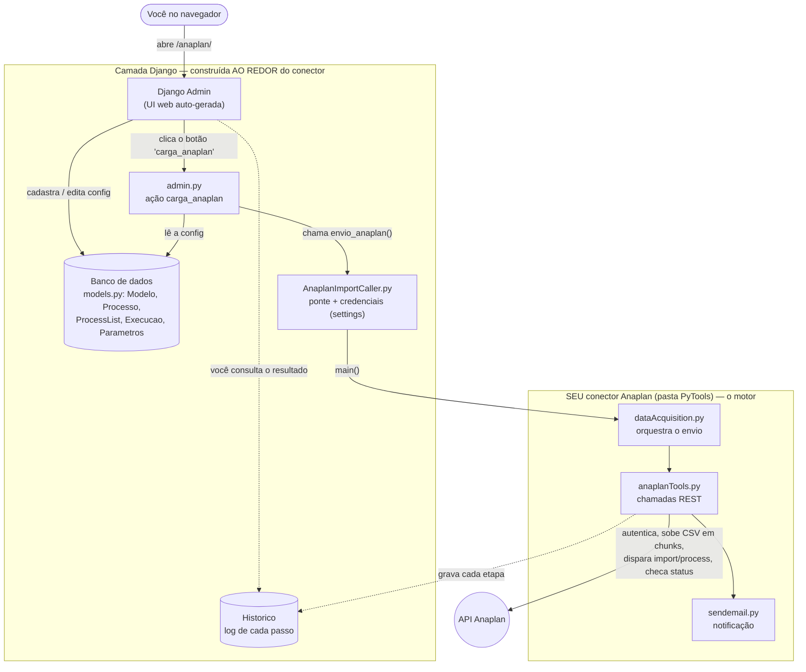

# Arquitetura da solução

> Como o Django funciona e o que foi construído **ao redor** do seu conector Anaplan.
>
> Resumo de uma frase: **seu conector é o motor; o Django é o painel de controle + o
> banco de dados construídos em volta dele.**

---

## 1. Como o Django funciona (em 1 minuto)

Django é o "lado servidor" de uma aplicação web. Um navegador faz uma requisição HTTP;
o Django decide qual código roda, conversa com o banco de dados, monta o HTML e devolve a
resposta. As peças (padrão "MTV" — Model, Template, View):

| Peça | Arquivo aqui | O que é |
|---|---|---|
| **URLs** | `anaplan/anaplan/urls.py` | O roteador: liga um endereço (`/anaplan/`) a um código |
| **Models** | `integrador/models.py` | Classes Python que viram **tabelas no banco** (o ORM) |
| **Views** | `integrador/views.py` | Lógica que responde a uma requisição — **aqui está vazio** |
| **Templates** | `templates/admin/*.html` | HTML (aqui, só ajustes de marca no admin) |
| **Admin** | `integrador/admin.py` | UI web de cadastro **gerada automaticamente** a partir dos models |
| **Migrations** | `integrador/migrations/` | Histórico versionado do schema do banco |
| **Settings** | `anaplan/anaplan/settings.py` | Configuração (agora via variáveis de ambiente) |
| **manage.py** | `anaplan/manage.py` | Utilitário de linha de comando: `runserver`, `migrate`, `test`… |

**A sacada deste projeto:** ele quase não tem views/templates próprios. A interface inteira é
o **Django Admin** — a tela de cadastro/edição que o Django entrega de graça quando você
registra um model. O dev aproveitou isso para não precisar escrever um front-end.

---

## 2. As duas camadas

### 🟩 Seu conector — o motor (`integrador/PyTools/`)
O código que **você** escreveu, que fala com o Anaplan:

- **`anaplanTools.py`** — as chamadas REST: autenticar, subir CSV, disparar import/process,
  checar status. **É o coração.**
- **`anaplanConnection.py`** — guarda o token + os IDs de workspace/model.
- **`dataAcquisition.py`** — orquestra: conecta → sobe arquivos → roda imports → roda processes.
- **`sendemail.py`** — notificação por e-mail.

### 🟦 O que o dev construiu ao redor — o painel (Django)
- **`models.py`** — transformou "o que enviar" em **tabelas editáveis**: `Modelo`, `Processo`,
  `ProcessList`, `Execucao`, `ParametrosProcessList`, `ParametrosExecucao` e `Historico` (log).
  Antes a config vivia em listas dentro do código; agora vive no banco.
- **`admin.py`** — registra esses models no Admin (você ganha formulários web) **e** adiciona o
  botão/ação **`carga_anaplan`**, que dispara o envio.
- **`AnaplanImportCaller.py`** — a **ponte** entre o mundo Django (banco) e o seu conector
  (PyTools). Pega a credencial (hoje das settings/env) e chama `dataAcquisition.main(...)`.
- **`urls.py`, `settings.py`, `templates/`** — o encanamento web e a marca.

---

## 3. O que acontece quando você clica "carga_anaplan"

```
1. Você abre /anaplan/ → login do Admin (templates/admin/login.html)
2. Cadastra uma "Execução" (quais arquivos, quais processos)
        → vira linhas no banco (models.py + formulários gerados pelo admin.py)
3. Seleciona a Execução e clica na ação "carga_anaplan"
4. admin.py::carga_anaplan lê a config do banco e monta as listas de arquivos/parâmetros
5. Chama envio_anaplan(...) em AnaplanImportCaller.py        ← a PONTE
6. Que pega a credencial (settings/env) e chama dataAcquisition.main(...)   ← SEU conector
7. anaplanTools.py faz o trabalho real:
        autentica → sobe CSV → dispara import/process → fica checando o status
8. Cada passo grava uma linha em Historico; opcionalmente manda e-mail
9. O navegador te leva para a lista de Historico → você vê o que aconteceu
```

---

## 4. Diagrama



> No GitHub, este diagrama aparece **renderizado** (visual), não como texto.

---

## 5. Para onde isso evolui (Fase 1)

Hoje a ponte (`AnaplanImportCaller`) chama o Anaplan diretamente e a credencial é única
(mono-tenant). Na Fase 1, o conector vira um **adaptador** com uma interface limpa
(`autenticar / enviar_arquivo / rodar_ação / status`) e a credencial vira um **cofre por
cliente**. Isso isola tudo por tenant, deixa o código fácil de testar (basta simular o
adaptador) e abre espaço para o **adaptador do IBM Planning Analytics (TM1)** depois — exatamente
o que está no **Norte** do roadmap.
